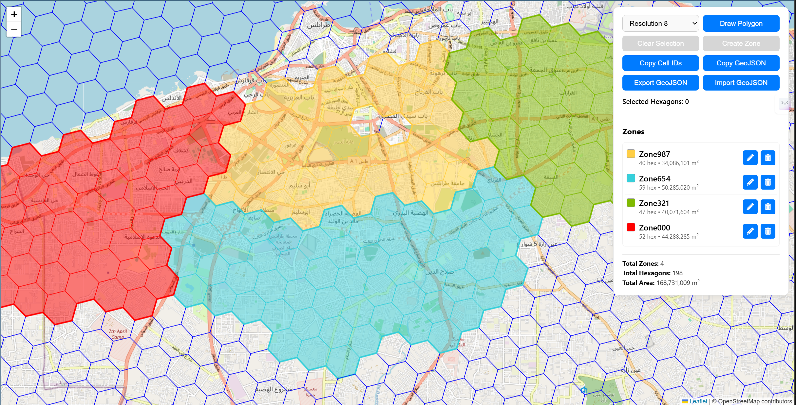

# Leaflet Map with H3 Cells

This project demonstrates an interactive web map using Leaflet.js and the H3 geospatial indexing system. The map allows users to visualize, select, and interact with H3 hexagonal cells.

## Live demo
You can try the live demo [here](https://alti3.github.io/HexPicker/).

https://alti3.github.io/HexPicker/

## Screenshot


## Features

- Interactive map centered on user-defined coordinates (default: Tripoli, Libya)
- Display of H3 hexagonal cells (default resolution: 8)
- Ability to select individual cells by clicking
- Draw polygon tool to select multiple cells at once
- Copy selected cell IDs to clipboard
- Copy selected polygon GeoJSON to clipboard (try visiting [geojson.io](https://geojson.io/) and pasting the clipboard content)
- Clear all selected cells
- Real-time counter for selected hexagons

## Technologies Used

- HTML5
- CSS3
- JavaScript
- [Leaflet.js](https://leafletjs.com/) for map rendering
- [Leaflet.draw](https://leaflet.github.io/Leaflet.draw/docs/leaflet-draw-latest.html) for polygon drawing functionality
- [H3-js](https://github.com/uber/h3-js) for H3 geospatial indexing

## Usage

1. Open `index.html` in a web browser to view the map.
2. Click on individual hexagons to select/deselect them.
3. Use the "Draw Polygon" button to select multiple hexagons at once.
4. Click "Copy Cell IDs" to copy the selected cell IDs to your clipboard.
5. Use "Clear Selected" to deselect all hexagons.

## Installation

No installation is required. Simply clone the repository and open `index.html` in a web browser.

```bash
git clone https://github.com/alti3/HexPicker.git
cd HexPicker
open index.html
```

## Using Docker
Build and run the docker image with the following commands:

```bash
docker build -t hexpicker .
docker run -p 8080:80 hexpicker
```

Then open [http://localhost:8080](http://localhost:8080) in a web browser.

## Contributing

Contributions are welcome! Please feel free to submit a Pull Request.

## License

This project is open source and available under the [MIT License](LICENSE).